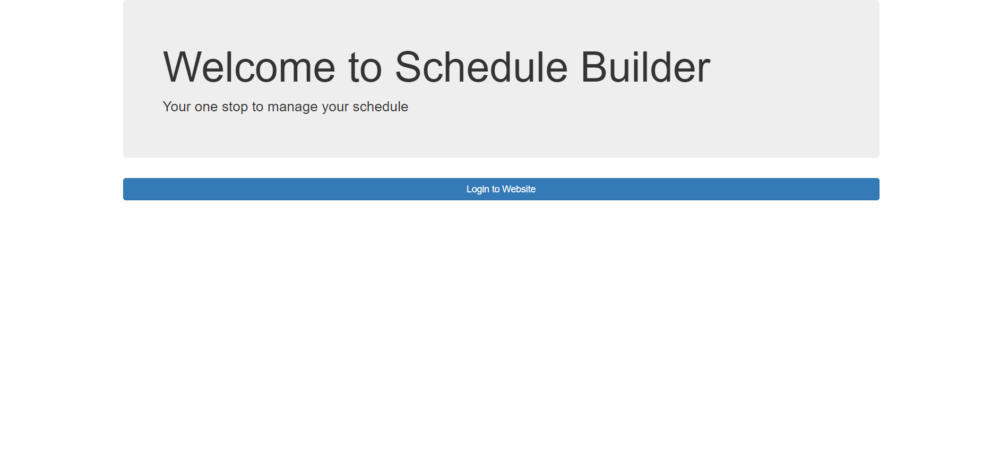
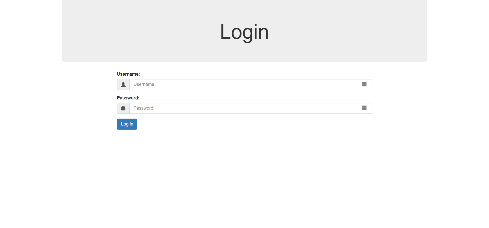
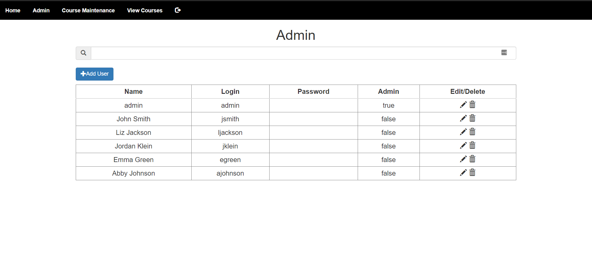
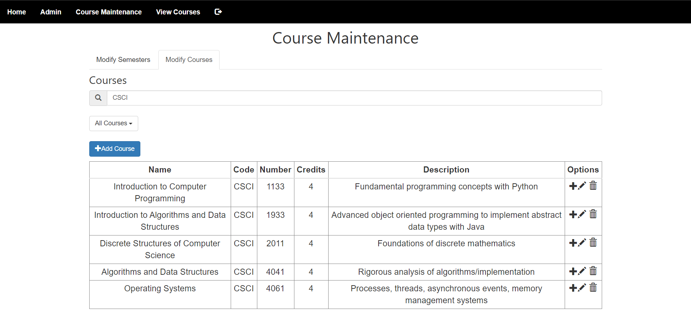
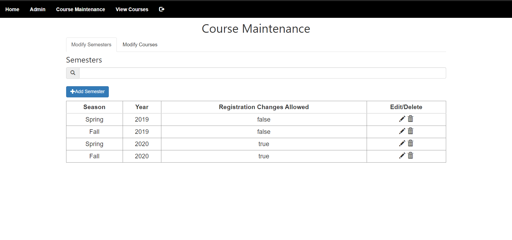
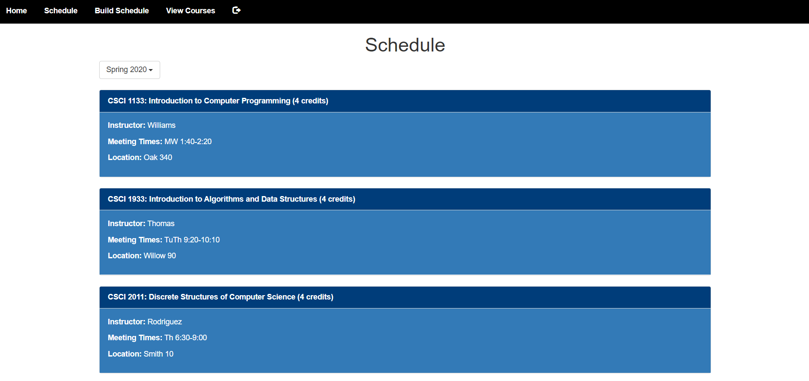
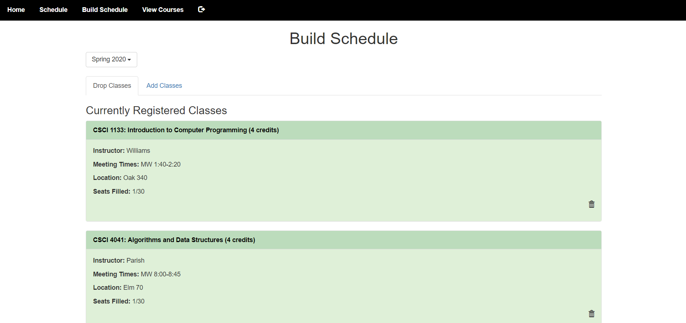
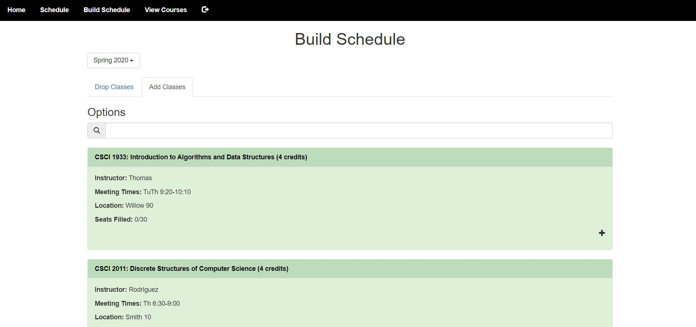
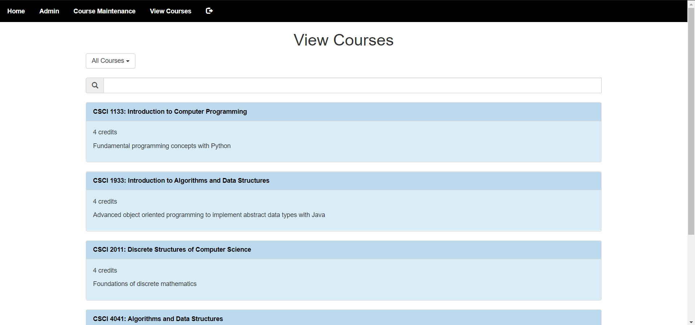

# Schedule Builder

## Basic Overview

Schedule Builder is an application that students can use to create their schedule by viewing the courses offered, adding classes, dropping classes, and viewing past schedules. It is also used by administrators to modify, add, and delete courses and to change which users can log into Schedule Builder.

## Terminology

    - Semester: A time period where students can register for classes.

    - Course: A class that has a name, department code, number, credit number, and description. A course does not pertain to any specific semester.

    - Course Offering: A course that pertains to a specific semester that also has the location, professor, capacity, and time.

## Types of Users

<table>
    <tr>
        <th>User Type</th>
        <th>Accessible Pages</th>
    </tr>
    <tr>
        <td>Admin User</td>
        <td>Admin, Course Maintenance, View Courses</td>
    </tr>
    <tr>
        <td>Student User</td>
        <td>Schedule, Build Schedule, View Courses</td>
    </tr>
</table>

## Page Overview

<table>
    <tr>
        <th>Page Name</th>
        <th>User</th>
        <th>Purpose</th>
    </tr>
    <tr>
        <td>Home</td>
        <td>anyone</td>
        <td>Welcome to Schedule Builder</td>
    </tr>
    <tr>
        <td>Login</td>
        <td>anyone</td>
        <td>Enter username and password to log in</td>
    </tr>
    <tr>
        <td>Admin</td>
        <td>admin</td>
        <td>Add, delete, and edit users who can access Schedule Builder</td>
    </tr>
    <tr>
        <td>Course Maintenance</td>
        <td>admin</td>
        <td>Add, delete, and edit semesters, courses, and course offerings</td>
    </tr>
    <tr>
        <td>Schedule</td>
        <td>student</td>
        <td>View specific student's past and current schedules</td>
    </tr>
    <tr>
        <td>Build Schedule</td>
        <td>student</td>
        <td>Add and drop classes for student</td>
    </tr>
    <tr>
        <td>View Courses</td>
        <td>admin, student</td>
        <td>View courses and course offerings</td>
    </tr>
</table>

## Pages

### Home Page

### Login Page

### Admin Page

### Course Maintenance Page

### Schedule Page

### Build Schedule Page

### View Courses Page

## Scripts

## Styles

## Database