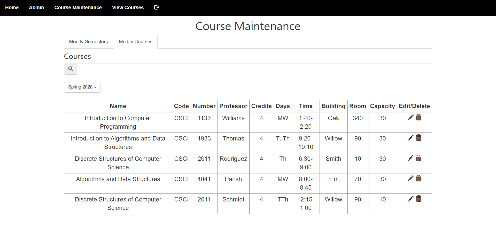
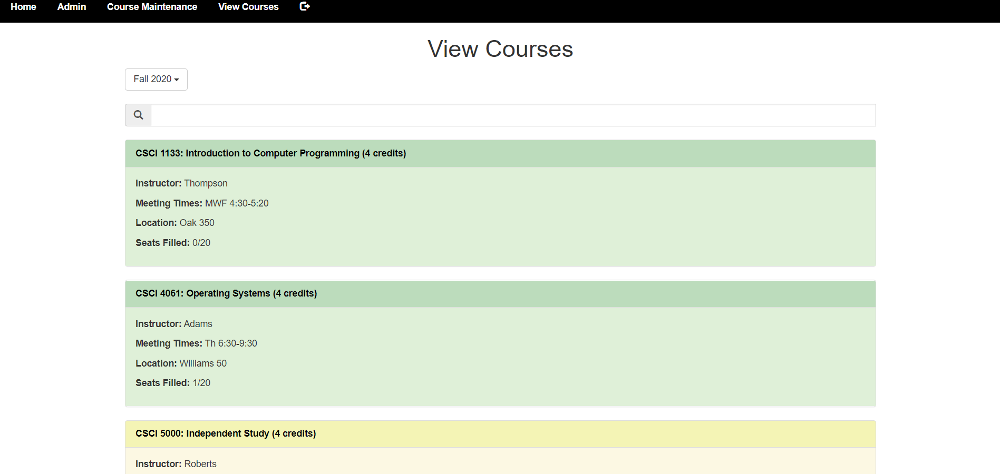

# Schedule Builder

## Basic Overview

Schedule Builder is an application that students can use to create their schedule by viewing the courses offered, adding classes, dropping classes, and viewing past schedules. It is also used by administrators to modify, add, and delete courses and to change which users can log into Schedule Builder.

## How It Works
    - Images of ScheduleBuilder can be found in the /pageDisplay folder.

## Terminology

    - Semester: A time period where students can register for classes.

    - Course: A class that has a name, department code, number, credit number, and description. A course does not pertain to any specific semester.

    - Course Offering: A course that pertains to a specific semester that also has the location, professor, capacity, and time.

## Types of Users

<table>
    <tr>
        <th>User Type</th>
        <th>Accessible Pages</th>
    </tr>
    <tr>
        <td>Admin User</td>
        <td>Admin, Course Maintenance, View Courses</td>
    </tr>
    <tr>
        <td>Student User</td>
        <td>Schedule, Build Schedule, View Courses</td>
    </tr>
</table>

## Page Overview

<table>
    <tr>
        <th>Page Name</th>
        <th>User</th>
        <th>Purpose</th>
    </tr>
    <tr>
        <td>Home</td>
        <td>anyone</td>
        <td>Welcome to Schedule Builder</td>
    </tr>
    <tr>
        <td>Login</td>
        <td>anyone</td>
        <td>Enter username and password to log in</td>
    </tr>
    <tr>
        <td>Admin</td>
        <td>admin</td>
        <td>Add, delete, and edit users who can access Schedule Builder</td>
    </tr>
    <tr>
        <td>Course Maintenance</td>
        <td>admin</td>
        <td>Add, delete, and edit semesters, courses, and course offerings</td>
    </tr>
    <tr>
        <td>Schedule</td>
        <td>student</td>
        <td>View specific student's past and current schedules</td>
    </tr>
    <tr>
        <td>Build Schedule</td>
        <td>student</td>
        <td>Add and drop classes for student</td>
    </tr>
    <tr>
        <td>View Courses</td>
        <td>admin, student</td>
        <td>View courses and course offerings</td>
    </tr>
</table>

## Pages

### Home Page

### Login Page

Users log into Schedule Builder by entering their username and password. If the login info is not validated, an error message will be displayed. If the user logs in successfully, they will be redirected to a page based on the type of user they are; admin users will go to the Admin page, and student users will go to the Schedule page. 

### Admin Page

Admin users can add users by using a modal that comes up when the Add User button is clicked. They can edit a user using a modal that comes up when the pencil icon of their row is pressed. They can delete a user by pressing the trash can of their row. Also, they can filter out rows by using the input box above the button.

### Course Maintenance Page

#### Modify Courses Tab

Similar to the Admin Page, admin users can add courses by filling out the modal that comes up from pressing the Add Course button. They can edit with a modal or delete a course by pressing the course's pencil or trash can icon. By pressing the plus button next to a course, a modal will come up and the admin user can create a course offering for the course.

Admin users can edit and delete course offerings in the same way.

Courses and course offerings can be filtered using the input box with the search icon.

An error message will be displayed if an admin user tries to delete a course that already has a corresponding course offering. Also, an error message will be shown if an admin user tries to delete a course offering that a student has already registered for. A success message will be displayed if a course offering or course is successfully added, edited, or deleted.

#### Modify Semesters Tab

Admin users can add, edit, and delete semesters in this tab, similarly to the Modify Courses Tab.

Semesters can be filtered using the input box with the search icon.

An error message will be displayed if an admin user tries to delete a semester that already has a corresponding course offering. A success message will be displayed if a semester is successfully added, edited, or deleted.

### Schedule Page

Students can view their past and current schedules on this page by selecting a semester from the dropdown. The only semesters that show up in the dropdown are ones where the student took or is taking a course.

### Build Schedule Page

A student can choose a semester and view their current classes. They can delete a class from their schedule by clicking the trash can icon. A success message is displayed when a student successfully deletes a class.

A student can choose a semester and view courses they are not currently registered for. They can add one of these classes to their schedule by clicking the plus icon. A success message is displayed when a student successfully adds a class.

### View Courses Page

An admin user or a student can view all possible courses.

An admin user or a student can view all course offerings for any semester selected. 

Courses or course offerings can be filtered using the input box with the search icon.

## Scripts

<table>
    <tr>
        <th>File</th>
        <th>Pages Used</th>
        <th>Purpose</th>
    </tr>
    <tr>
        <td>adminScripts.js</td>
        <td>Admin</td>
        <td>
            <ul>
                <li>Getting and displaying user information</li> 
                <li>Using modals to add, edit, and delete users</li>
            </ul>
        </td>
    </tr>
    <tr>
        <td>buildScheduleScripts.js</td>
        <td>Build Schedule</td>
        <td>
            <ul>
                <li>Deleting and adding classes</li> 
            </ul>
        </td>
    </tr>
    <tr>
        <td>courseModalScripts.js</td>
        <td>Course Maintenance: Modify Courses Tab</td>
        <td>
            <ul>
                <li>Edit and add courses with modal</li> 
                <li>Delete courses</li>
            </ul>
        </td>
    </tr>
    <tr>
        <td>coursePanelScripts.js</td>
        <td>View Courses</td>
        <td>
            <ul>
                <li>Retrieve and display courses using Bootstrap panels</li> 
            </ul>
        </td>
    </tr>
    <tr>
        <td>courseTableScripts.js</td>
        <td>Course Maintenance</td>
        <td>
            <ul>
                <li>Retrieve and display courses in a table format</li> 
                <li>Switch between showing offering table and course table</li>
            </ul>
        </td>
    </tr>
    <tr>
        <td>filterScripts.js</td>
        <td>Admin, Build Schedule, Course Maintenance, View Courses</td>
        <td>
            <ul>
                <li>Filter courses, offerings, semesters, or users based on what is searched for</li> 
            </ul>
        </td>
    </tr>
    <tr>
        <td>navigationBarScripts.js</td>
        <td>Admin, Build Schedule, Course Maintenance, Schedule, View Courses</td>
        <td>
            <ul>
                <li>Show the right options in navigation bar based on type of user</li> 
            </ul>
        </td>
    </tr>
    <tr>
        <td>offeringModalScripts.js</td>
        <td>Course Maintenance: Modify Courses Tab</td>
        <td>
            <ul>
                <li>Edit and add course offerings with modal</li> 
                <li>Delete course offerings</li>
            </ul>
        </td>
    </tr>
    <tr>
        <td>offeringPanelScripts.js</td>
        <td>Build Schedule, Schedule, View Courses</td>
        <td>
            <ul>
                <li>Retrieve and display offerings using Bootstrap panels</li> 
            </ul>
        </td>
    </tr>
    <tr>
        <td>offeringTableScripts.js</td>
        <td>Course Maintenance</td>
        <td>
            <ul>
                <li>Retrieve and display offerings in a table format</li> 
            </ul>
        </td>
    </tr>
    <tr>
        <td>semesterDropdownTableScripts.js</td>
        <td>Build Schedule, Course Maintenance, Schedule, View Courses</td>
        <td>
            <ul>
                <li>Retrieve and display semesters in a dropdown</li> 
                <li>Update dropdown when an option is selected</li> 
                <li>Retrieve and display semesters in a table format for Course Maintenance</li>
            </ul>
        </td>
    </tr>
    <tr>
        <td>semesterModalScripts.js</td>
        <td>Course Maintenance: Modify Semesters Tab</td>
        <td>
            <ul>
                <li>Edit and add semesters with modal</li> 
                <li>Delete semesters</li>
            </ul>
        </td>
    </tr>
    <tr>
        <td>index.js</td>
        <td>Server</td>
        <td>
        </td>
    </tr>
</table>

## Styles

Bootstrap is used to style most of the application. scheduleBuilderStyle.css is used for custom styles.

## Database

### Users Table
    - Keep track of users of Schedule Builder and their login info
    - UserLogin is unique

<table>
    <tr>
        <th>Column</th>
        <th>Description</th>
    </tr>
    <tr>
        <td>UserID</td>
        <td>Primary Key</td>
    </tr>
    <tr>
        <td>UserName</td>
        <td>Name of the user</td>
    </tr>
    <tr>
        <td>UserLogin</td>
        <td>Login for the user</td>
    </tr>
    <tr>
        <td>UserPassword</td>
        <td>Password for the user</td>
    </tr>
    <tr>
        <td>isAdmin</td>
        <td>1 for admin user and 0 for student user</td>
    </tr>
</table>

### Courses Table
    - Keep track of courses
    - DeptCode and CourseNumber combination are unique

<table>
    <tr>
        <th>Column</th>
        <th>Description</th>
    </tr>
    <tr>
        <td>CourseID</td>
        <td>Primary Key</td>
    </tr>
    <tr>
        <td>DeptCode</td>
        <td>Department code for course (like CSCI for computer science)</td>
    </tr>
    <tr>
        <td>CourseNumber</td>
        <td>Number for course (like 101)</td>
    </tr>
    <tr>
        <td>CourseName</td>
        <td>Name of the course</td>
    </tr>
    <tr>
        <td>CreditNumber</td>
        <td>Number of credits for course</td>
    </tr>
    <tr>
        <td>CourseDescription</td>
        <td>Brief description of the course</td>
    </tr>
</table>

### Semesters Table
    - Keep track of semesters that courses can be taken
    - Season and Year combination is unique

<table>
    <tr>
        <th>Column</th>
        <th>Description</th>
    </tr>
    <tr>
        <td>SemesterID</td>
        <td>Primary Key</td>
    </tr>
    <tr>
        <td>Season</td>
        <td>Description of time period (like fall, spring)</td>
    </tr>
    <tr>
        <td>Year</td>
        <td>Year when semester is taken</td>
    </tr>
    <tr>
        <td>isRecent</td>
        <td>
            <ul>
                <li>0 for semesters that are further in the past so registrations cannot change; semester is set</li>
                 <li>1 for semesters that are more recent so registrations can change</li>
            </ul>
        </td>
    </tr>
</table>

### CourseOfferings Table
    - Keep track of offerings, which are courses for a specific semester

<table>
    <tr>
        <th>Column</th>
        <th>Description</th>
    </tr>
    <tr>
        <td>OfferingID</td>
        <td>Primary Key</td>
    </tr>
    <tr>
        <td>CourseID</td>
        <td>Foreign Key to Courses table</td>
    </tr>
    <tr>
        <td>SemesterID</td>
        <td>Foreign Key to Semesters table</td>
    </tr>
    <tr>
        <td>Professor</td>
        <td>Instructor for the course offering</td>
    </tr>
    <tr>
        <td>DaysOfWeek</td>
        <td>Days where offering takes place (like MTWThF)</td>
    </tr>
    <tr>
        <td>Time</td>
        <td>Time for the offering (like 1:15PM-2PM)</td>
    </tr>
    <tr>
        <td>Building</td>
        <td>Building for course offering</td>
    </tr>
    <tr>
        <td>Room</td>
        <td>Room for course offering</td>
    </tr>
    <tr>
        <td>Capacity</td>
        <td>Maximum number of students who can sign up for offering</td>
    </tr>
</table>

### Registrations Table
    - Keep track of course offerings that a student is taking
    - StudentID and OfferingID combination is unique

<table>
    <tr>
        <th>Column</th>
        <th>Description</th>
    </tr>
    <tr>
        <td>RegistrationID</td>
        <td>Primary Key</td>
    </tr>
    <tr>
        <td>StudentID</td>
        <td>Foreign Key to Users table</td>
    </tr>
    <tr>
        <td>OfferingID</td>
        <td>Foreign Key to CourseOfferings table</td>
    </tr>
</table>